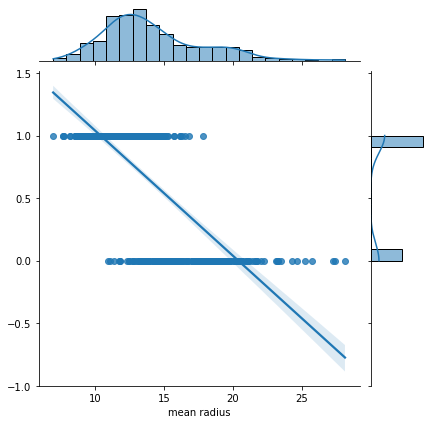
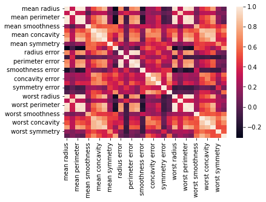
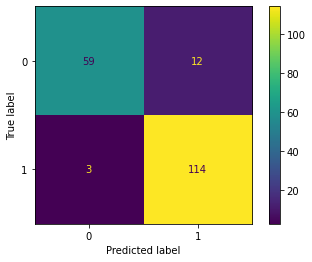

# Breast Cancer classifier with Support Vector Machine

Can we predict if a observed tumor is malignant or benign? 

In this example, I'm using data from sklearn (https://scikit-learn.org/stable/modules/generated/sklearn.datasets.load_breast_cancer.html).
I'm using sciKitlearn Support Vector Machine (SVM) algorithms to create a binary classification model to classify a tumor as MALIGNANT or BENIGN based on 30 distinct metrics.
Moreover, I'm optimising the accuracy with a grid search algoritm.

# Exploratory Data Analysis

## How does one's mean radius correspond to a tumor being malignant (0) or benign (1)?



## What are the correlations between the distinct metrics?



# Working on the model

Here I'm using y as the binary classification I'm trying to predict ("Malignant" X "Benign") and X is the dataset used to train the model (everything else).

The model will be trained with the X array, which we'll compare to the y array to evaluate the model at the end.

To train the model, I've used the Support Vector Machine method from the SciKitLearn library.

# Improving the model

In order to improve the model, we'll run a GridSearch:

GridSearchCV() takes a dictionary that describes the parameters that should be tried and a model to train. The grid of parameters is defined as a dictionary, where the keys are the parameters and the values are the settings to be tested.
GridSearchCV tries all the combinations of the values passed in the dictionary and evaluates the model for each combination using the Cross-Validation method.

At last, based on the output of our GridSearchCV(), we refit the model with the optimised parameters.

# How good the model is?
 
In order to evaluate the model, we can check its confusion matrix:



And also its classification report:

```
              precision    recall  f1-score   support

           0       0.94      0.89      0.91        71
           1       0.93      0.97      0.95       117

    accuracy                           0.94       188
   macro avg       0.94      0.93      0.93       188
weighted avg       0.94      0.94      0.94       188
```

# And what now?
Our model is already trained.
If you want to predict if a you just have to call their row under the predict function. You can do as such:

```
row_to_predict = *write down the row # here*
print(grid.predict(X.iloc[[row_to_predict]]))
```

## Libraries Used

| Name | Library |
| ------ | ------ |
| Pandas | https://pandas.pydata.org/ |
| Matplotlib | https://matplotlib.org/ |
| Seaborn | https://seaborn.pydata.org/ |
| SciKitLearn | https://scikit-learn.org/stable/ |